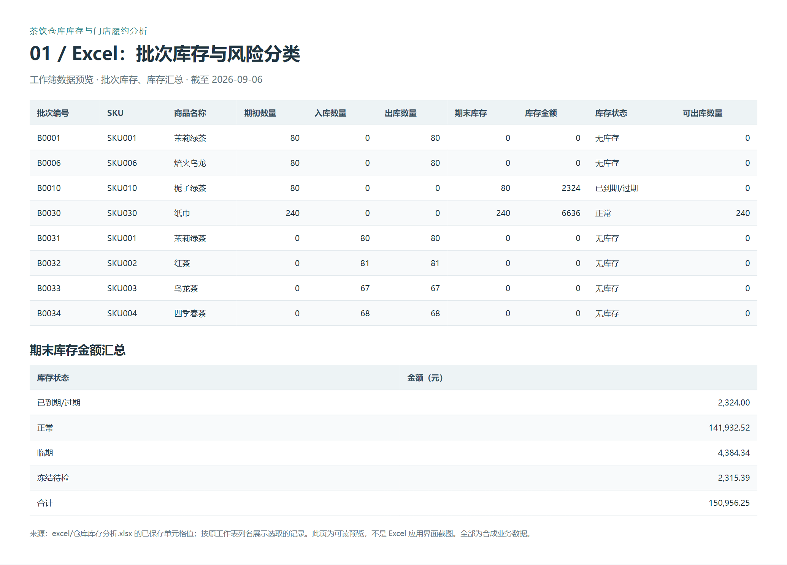
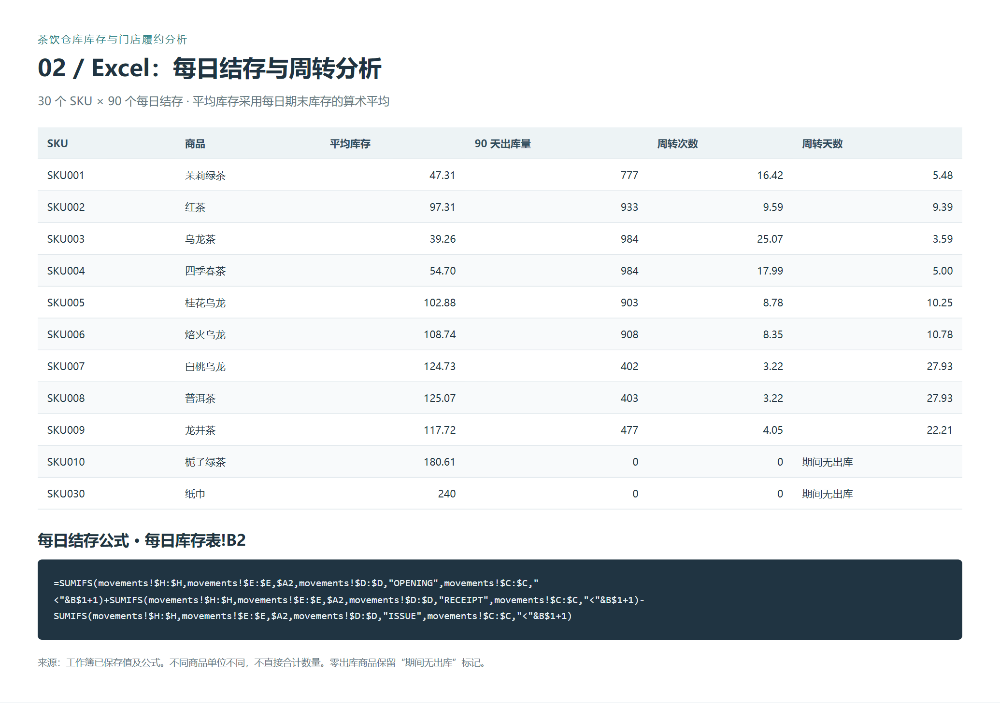
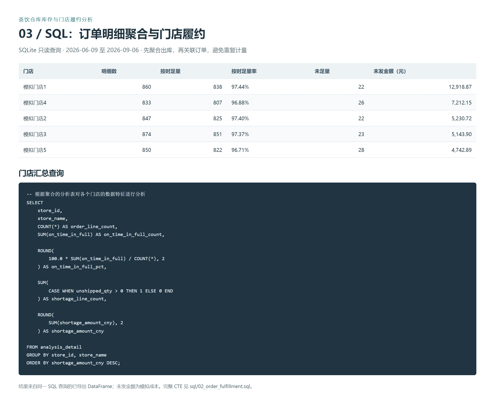
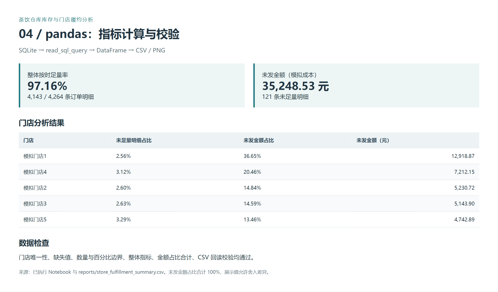

# 茶饮仓库库存与门店履约分析

围绕仓储专员的库存统计、周转分析与门店发货审核，使用 **Excel、SQLite、pandas、Matplotlib** 完成从原始数据到分析报告的完整流程。

项目覆盖 1 个仓库、5 家门店、30 个 SKU，统计期间为 **2026-06-09 至 2026-09-06，共 90 天**。数据由固定随机种子生成，非卡旺卡或其他企业的实际业务数据；成本、规格、保质期和储存条件为场景假设。

## 成果概览

|指标|结果|来源|
|---|---:|---|
|期末库存金额|150,956.25 元|Excel 批次库存与库存汇总|
|临期库存金额|4,384.34 元|Excel 库存状态分类|
|过期库存金额|2,324.00 元|Excel 库存状态分类|
|冻结待检库存金额|2,315.39 元|Excel 库存状态分类|
|订单明细数|4,264 条|SQL 门店履约汇总|
|整体按时足量率|97.16%|4,143 / 4,264 条明细|
|未足量明细数|121 条|SQL 门店履约汇总|
|未发金额|35,248.53 元|未发数量 × 固定模拟成本|

金额为人民币元。未发金额不等于销售损失；履约率按订单明细计算，不是整张订单，也不衡量配送签收。

## 完整流程

```text
9 张原始 CSV
├── Excel：主数据关联 → 批次库存 → 状态汇总 → 每日结存与周转 → 盘点差异
└── SQLite：字段类型 / 主外键 / 索引 → 出库聚合 → 订单关联 → 门店履约汇总
                                                     ↓
                          pandas：数据检查 → 比例与整体指标 → CSV
                                                     ↓
                          Matplotlib：未发金额图 / 按时足量率图
                                                     ↓
                          分析报告：问题优先级、核查方向、业务建议
```

Excel 和 SQLite 使用同一份原始数据，分别承担库存分析和订单履约分析；pandas 直接执行 SQL 查询，不需要将汇总结果回写数据库。

## 1. Excel：库存、周转与盘点

工作簿：[仓库库存分析.xlsx](excel/仓库库存分析.xlsx)

通过 VLOOKUP 关联商品档案，使用 SUMIFS 按批次、流水类型和日期汇总数量，使用 IF 与日期计算判断库存状态，并以数据透视表汇总库存金额。

|工作表|内容|
|---|---|
|products / batches / movements / stores / order_lines|导入的商品、批次、流水、门店与订单源数据|
|批次库存|224 个批次的期初、入库、出库、期末、金额、有效期和可出库数量|
|库存汇总|按互斥的优先库存状态汇总金额|
|每日库存表|30 个 SKU × 90 天结存，以及平均库存、出库量、周转次数与天数|
|stock_counts|196 条盘点记录，以及复盘差异、结果与差异金额|





以上为现有工作簿已保存单元格值和公式的浏览器预览截图，便于查看重点区域；并非 Excel 应用界面截图。完整原表保留在工作簿内，未重新设计或覆盖。

**库存发现：** SKU010 栀子绿茶在期间有入库无出库，其中 B0010 批次期末 80 袋已过期，对应 2,324 元；应核实需求后调整采购。SKU030 纸巾 90 天无收发，期末保留 240 包，应核实用途与实物。SKU001 茉莉绿茶周转 16.42 次、周转天数 5.48 天，需结合订单缺口判断是否备货不足。

详细结论：[库存与周转分析小结](reports/库存与周转分析小结.md)。

## 2. SQL：门店订单履约

数据库：[storage.sqlite](data/storage.sqlite) · 表结构：[schema.sql](sql/schema.sql) · 查询：[02_order_fulfillment.sql](sql/02_order_fulfillment.sql)

查询分为三层 CTE：

1. `shipment_summary`：按订单明细汇总截止时点前的实际出库量与按时发货量。
2. `order_detail`：筛选期间订单，LEFT JOIN 保留无出库订单，将缺失出库量处理为 0。
3. `analysis_detail`：关联门店和商品，计算履约状态、未发数量与成本金额，再按门店汇总。

一条订单明细可能对应多笔批次出库，因此先聚合流水，避免联表后重复计算申请数量。查询使用截止时点的左闭右开区间，保留最后一天的完整时间范围。



## 3. pandas：指标计算与数据检查

已运行文件：[01_fulfillment_pandas.ipynb](notebooks/01_fulfillment_pandas.ipynb) · [浏览器报告 HTML](reports/01_fulfillment_pandas.html)

- 使用只读 SQLite 连接与 `pd.read_sql_query` 获取门店汇总。
- 检查字段类型、缺失值、重复门店、负数与百分比边界。
- 计算未足量明细占比、未发金额占比及整体指标；整体比例按总分子与总分母计算。
- 按金额排序，导出 CSV；回读 CSV 核对类型和数值，验证金额占比合计为 100%。



## 4. Matplotlib：门店对比

金额图突出未发成本的集中度，按时足量率图采用横向点图，以明确标注的局部百分比坐标显示门店差异，并直接标注整体参考线与最大差距，两图均标注统计期与单位。


## 5. 分析结论与行动方向

|发现|证据|建议核查|
|---|---|---|
|S1 的未发金额最集中|12,918.87 元，占 36.65%；未足量 22 条|按 SKU、日期和单位成本拆解，核查大额需求与订单时点可用库存|
|S5 的未足量发生比例最高|28 条，占 3.29%；按时足量率 96.71%|查重复缺口商品、补货周期和库存分配顺序|
|S4 需要同步跟踪|26 条未足量，未发金额 7,212.15 元|联合比较缺口频次、金额与可用库存，确定核查优先级|

门店金额排名和缺口比例排名不同，应结合两类指标安排核查。模拟数据采用门店编号顺序分配库存，该规则可能影响门店间差异；当前汇总不能证明缺口由采购、人员或某一环节单独导致。

完整报告：[门店订货履约分析](reports/门店订货履约分析.md)。

## 数据与口径

|原始表|行数|作用|
|---|---:|---|
|products|30|商品、单位、成本、预警与储存参数|
|locations|30|货位、储存区与容量参数|
|stores|5|门店主数据|
|batches|224|批次、有效期与质量状态|
|receipts|194|到货与验收记录|
|order_lines|4,264|门店商品需求明细|
|movements|4,489|期初、入库与出库流水|
|stock_counts|196|账面快照与实盘记录|
|inspections|65|现场巡检观察|

- 期末库存 = 期初 + 入库 − 出库；冻结和过期库存仍属于账面库存。
- 可出库数量要求质量放行、尚未到期、结存为正；临期已放行库存仍可在规则允许时发货。
- 平均库存采用 90 个每日期末库存的均值；周转次数 = 期间出库量 / 平均库存。
- 不同 SKU 的基本单位不同，不能直接合计数量；跨商品比较使用金额。
- 按时足量要求在承诺发货时限内、且在报告截止时点之前累计发货达到申请量。
- 当前数据没有超时发货，因此未按时足量记录均为未发或部分发货。换用其他数据时，未足量比例不必等于 100% 减去按时足量率。

详见 [数据字典](docs/data_dictionary.md)、[业务规则](docs/business_rules.md)、[原始数据清单与 SHA256](data/manifest.json)。

## 运行与复现

运行环境为 WSL DevEnv；已有 `.venv` 时直接启动 Notebook：

```bash
cd /home/atori/workspace/storage
bash scripts/start_notebook.sh
```

新环境安装：

```bash
python3 -m venv .venv
.venv/bin/python -m pip install -r requirements-notebook.txt
```

从头运行并导出浏览器报告：

```bash
.venv/bin/jupyter nbconvert --to notebook --execute --inplace notebooks/01_fulfillment_pandas.ipynb
.venv/bin/jupyter nbconvert --to html notebooks/01_fulfillment_pandas.ipynb --output-dir reports
python3 scripts/validate_data.py
```

Notebook 自动从当前目录向上定位项目根目录。WSL 图表使用 Windows 微软雅黑字体；其他系统需配置可用的中文字体。数据库使用 STRICT 表，需要 SQLite 3.37 或以上。本项目验证环境为 Python 3.13、JupyterLab 4.6、pandas 3.0、Matplotlib 3.11。

若需从 CSV 重建数据库，运行 `python3 scripts/import_sqlite.py --output data/storage_new.sqlite`，导入器不会覆盖已有数据库。`scripts/generate_data.py` 以种子 `20260907` 重新生成原始数据、控制数据与数据字典；会覆盖其管理的文件，正常运行分析无需执行生成器。

## 输出与质量核对

|文件|内容|
|---|---|
|[store_fulfillment_summary.csv](reports/store_fulfillment_summary.csv)|5 家门店的汇总字段与新增比例|
|[fulfillment_overall.csv](reports/fulfillment_overall.csv)|整体履约指标|
|[figures/](reports/figures/)|两张 Matplotlib 图表|
|[screenshots/](reports/screenshots/)|Excel、SQL、pandas 数据预览页与截图|
|[excel_validation.json](checks/excel_validation.json)|224 个批次、2,700 个每日结存、30 个平均库存核对|
|[sqlite_import.json](checks/sqlite_import.json)|导入行数、完整性、外键与期末库存检查|
|[notebook_validation.json](checks/notebook_validation.json)|Notebook 指标与 CSV 回读检查|

Excel 检查基于已保存的单元格缓存，与原始 CSV 独立核对；没有改写或重新计算工作簿。Notebook 已从新内核完整运行并保存输出。

## 项目范围

已完成库存与周转分析、盘点差异明细、门店履约 SQL、pandas 汇总及图表报告。库位布局调整、补货策略落地、巡检闭环、WMS 部署和实际降本不属于已完成成果。原始数据保留相关字段供后续扩展；现有建议不表示真实业务改善已发生。
