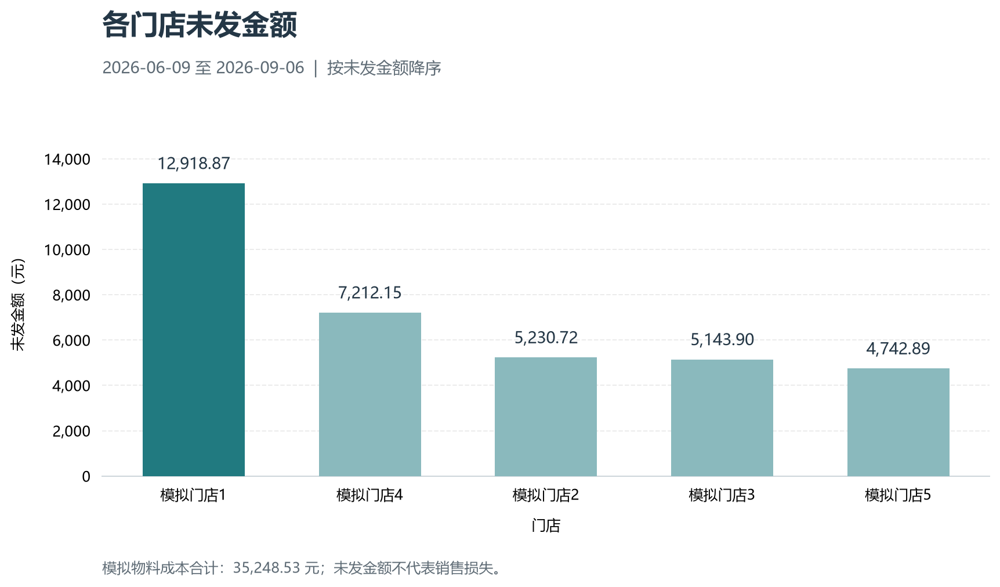
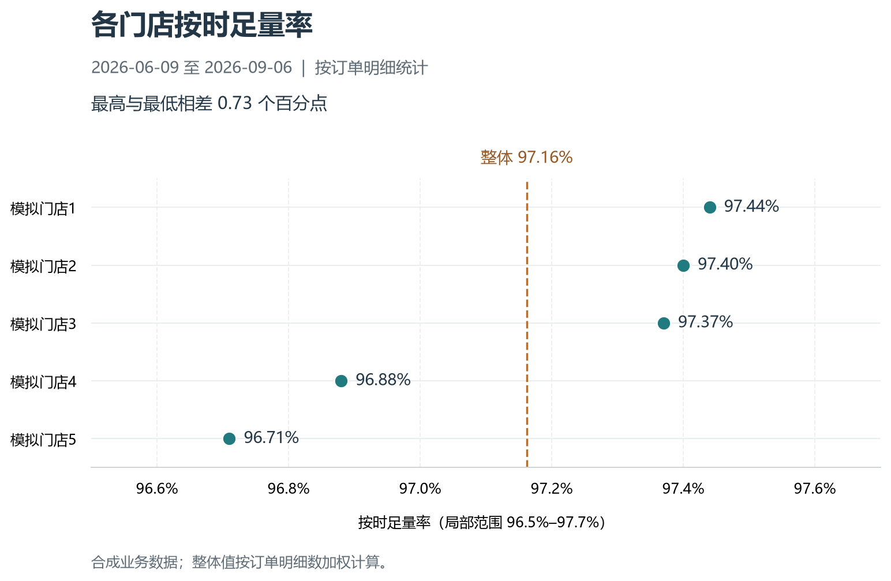

# 门店订货履约分析

统计期间：2026-06-09 至 2026-09-06，共90天。
报告截止：2026-09-07 00:00:00，不包含该时点。
数据性质：个人模拟项目，非卡旺卡真实业务数据。
查询来源：[02_order_fulfillment.sql](../sql/02_order_fulfillment.sql)。
数据库：`../data/storage.sqlite`。本报告基于该文件的只读查询结果。

## 分析方法与口径

通过SQL关联订单明细、出库流水、门店和商品档案，先按订单明细汇总实际出库，再与期间创建的订单关联，计算各门店履约指标。

- 统计单位为订单明细行，不是整张订单；一行表示一个商品需求。
- 一条需求可能对应多个批次出库，先聚合出库再关联，避免申请量重复计算。
- 保留没有出库记录的订单，对应已发数量为0。
- 按时足量：截至承诺发货时限且在报告截止时点之前的累计发货量达到申请量。
- 缺口数量：申请量减去截至报告时点的已发量。
- 缺口金额：各明细缺口数量乘以该SKU固定模拟成本，按明细保留两位小数后汇总；不是销售损失。
- 缺口行率：存在缺口的明细行数除以全部明细行数。
- 实际发货时间衡量仓库出库，不代表门店签收或配送到达时间。

## 整体表现

5家门店共4,264条订单明细，4,143条按时足量，整体按时足量行率97.16%；121条存在缺口，缺口行率2.84%。缺口金额合计35,248.53元。

## 门店对比

|门店|订单明细数|按时足量行数|按时足量行率|缺口行数|缺口金额（元）|
|---|---:|---:|---:|---:|---:|
|S1 模拟门店1|860|838|97.44%|22|12,918.87|
|S4 模拟门店4|833|807|96.88%|26|7,212.15|
|S2 模拟门店2|847|825|97.40%|22|5,230.72|
|S3 模拟门店3|874|851|97.37%|23|5,143.90|
|S5 模拟门店5|850|822|96.71%|28|4,742.89|
|合计|4,264|4,143|97.16%|121|35,248.53|

合计比例按总分子除以总分母计算，不直接平均各门店百分比。

## 主要发现

### S1：缺口金额最高

缺口金额12,918.87元，占整体约36.65%，但缺口行数仅22条。说明缺口金额较为集中，建议先查高金额缺口明细，区分大数量需求和高单价商品的影响。当前汇总尚不足以判断具体成因。

### S5：缺口行数最多

缺口行数28条，缺口行率3.29%，按时足量行率96.71%，为五家门店最低。建议按商品和日期下钻，核查是否存在反复缺货。

### S4：缺口规模与发生频次均值得关注

缺口金额7,212.15元，缺口行数26条。建议结合订单规模、需求变化及可用库存进一步分析。

## 后续核查

1. 按门店、商品、日期查看缺口明细，优先追查S1的大金额缺口。
2. 对照订单时点的可用库存，区分账面库存不足与过期、冻结导致的不可用。
3. 检查订货量是否明显偏离历史申请水平，异常仅作待确认提示。
4. 检查按门店顺序分配库存的基准规则对缺口分布的影响。

## 分析局限

当前模拟数据没有超时发货，未按时足量的记录均为未发货或部分发货，无法据此评价真实配送时效。模拟库存按门店顺序分配，该规则可能影响门店间结果，不能直接归因于人员表现。

建议尚未实施，不代表实际改善或降本成果。

## 校验结果

查询输出5行；订单明细数合计4,264，缺口行数合计121。当前无超时发货，每家门店均满足：按时足量行数＋缺口行数＝订单明细总行数。

## pandas 与 Matplotlib 产物

Notebook 已完成只读查询、数据检查、比例计算、整体汇总和结果导出；CSV 回读与金额占比校验通过。

- [门店汇总 CSV](store_fulfillment_summary.csv)
- [整体汇总 CSV](fulfillment_overall.csv)
- [已运行 Notebook](../notebooks/01_fulfillment_pandas.ipynb)

